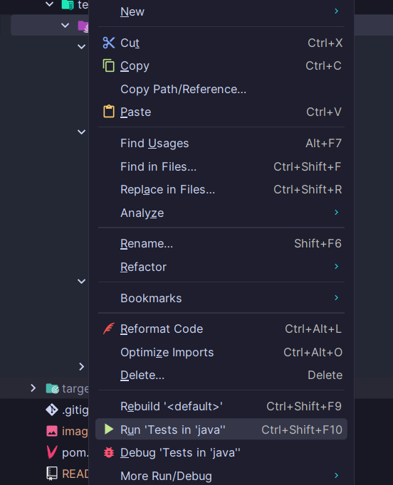
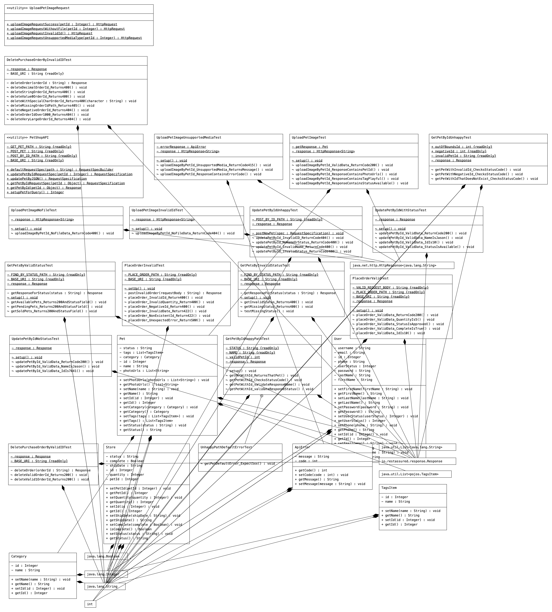

# Pet Store Testing API
This is **testware** for the [Swagger Pet Store API](https://petstore3.swagger.io/).

The test cases included cover all but one of the available endpoints described in the documentation.

The team decided to use the **Moscow** prioritisation method to set goals for the project shown below:

## Moscow Objectives
#### Must Have
- [Github](https://github.com/claytesting/PetStoreAPITesting)
- User Stories for each Endpoint with acceptance criteria
- At least 3 endpoints tested
- Test execution engine (run unit, API).
- Happy and sad path tests
- Assertions & validation support (Hamcrest, JUnit assertions).
- Error handling & exception reporting.
- [Defect report](https://testingcircle-my.sharepoint.com/:w:/r/personal/ofelgate_spartaglobal_com/Documents/PetShop%20API%20-%20Defect%20Report.docx?d=w55570ce636fb4354a92af7b4c5ef2cdb&csf=1&web=1&e=vVGgX9)
- [Trello board](https://trello.com/b/oOEozyBe/petstore)
- Regular Stand-ups with team and trainer

#### Should Have
- Reusable utilities.
- Logging & reporting (console + structured test reports).
- Configuration management (base URLs, credentials, environment configs).
 
#### Could Have
- CI/CD integration (GitHub Actions).
- If an API key was provided some of the endpoints could have better been explored

#### Won’t Have (This Time)
- Performance testing

## Communication
 
#### Mode:
- Microsoft Teams Meeting
 
#### Scrum:
- Stand-up meetings twice a day
- Rotated scrum master with each team member (2 per day)
 
#### Scrum activities:
- Discussed what we have completed, what we will do next, and any blockers we were experiencing
- Documented issues and defects
- Updated the Trello project board
 
#### Teamwork:
- Discussed the blockers and worked together to problem solve the issues
- Pair programmed for some tasks

## How to use the framework:
1. Use Intellij to create a Maven project 
1. Clone Repo 
    `git clone https://github.com/claytesting/PetStoreAPITesting.git`
1. Install dependencies in from the pom.xml
1. Build project using Maven
1. Run all tests:

## Further Collaboration
If another group was to take over this project, we would point them toward this README file as well as handing over the defect report and Postman collection. This would enable them to see all that has been found so far including all defects and how each endpoint works. If more help is required the team can be contacted via their emails.

## Class Diagram
